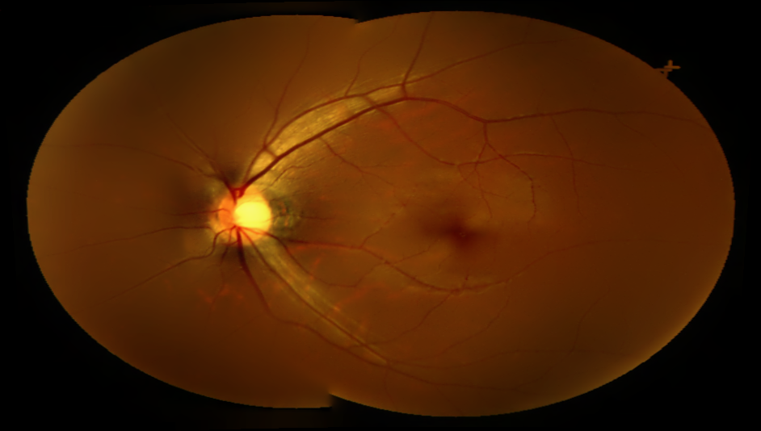
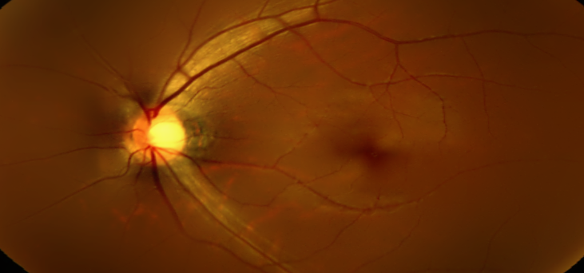

# 第二小组
作业：眼底图像拼接

## 1.文件结构

> image_mosaic
>
> > image_stitching_simple.py 	--简单图像拼接
> >
> > image_stitching.py	--图像拼接
> >
> > output.png	--拼接后的图片
> >
> > output2.png	--拼接后的图片
> >
> > images	--需要拼接的原图文件夹
> >
> > > scottsdale
> > >
> > > > left1.jpeg
> > > >
> > > > left2.jpeg
> > > >
> > > > left3.jpeg


---


## 2.简单图像拼接

完成简单的图像拼接

*运行程序*

```bash
python image_stitching_simple.py -i images/scottsdale -o output.png
```

*运行结果*




---


## 3. 图像拼接

完成带裁剪的图像拼接

*运行程序*

```bash
python image_stitching.py -i images/scottsdale -o output2.png --crop 1
```

*运行结果*




---

